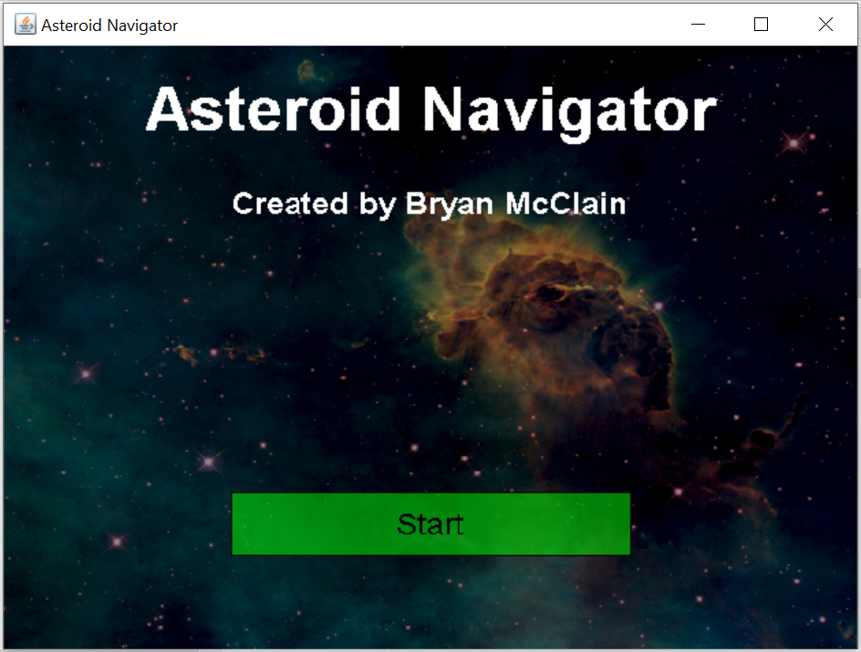
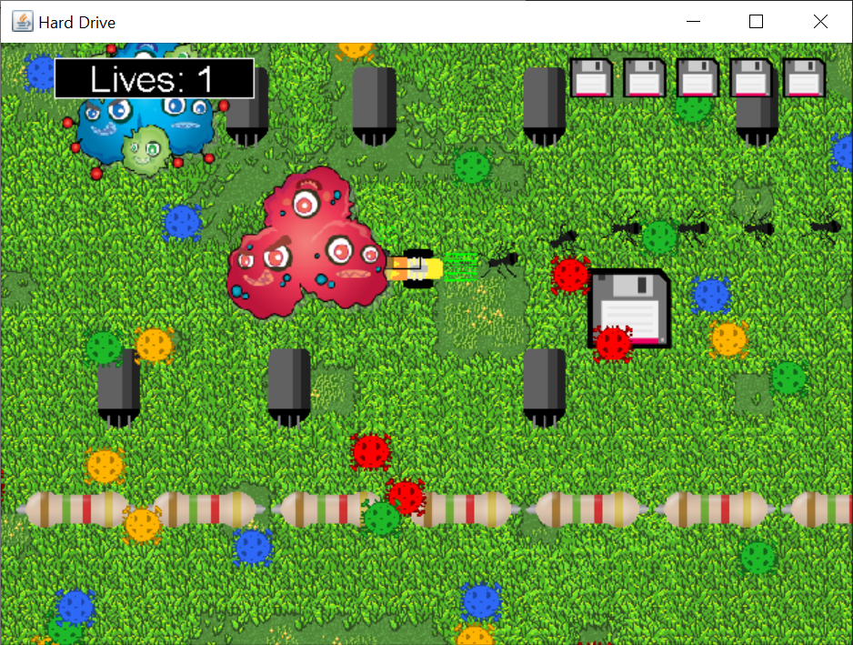
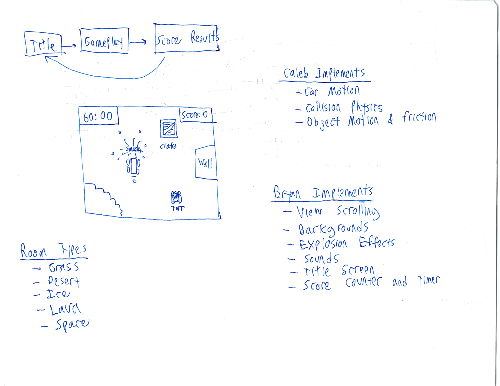
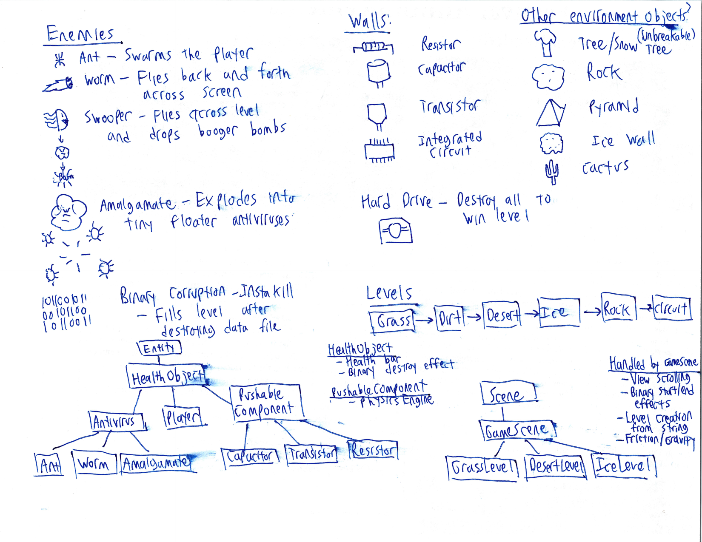
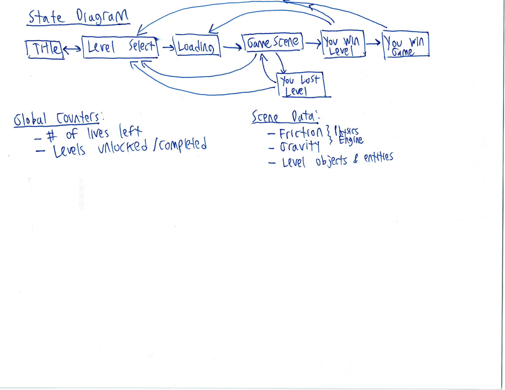
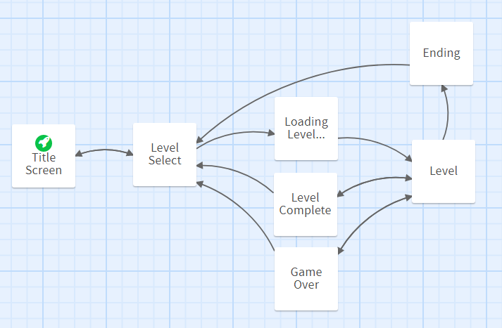
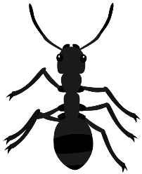
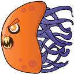

# Hard Drive Shredder
Created by Rohan (Mr.Robot)

Hard Drive Shredder is a Game which destroys all your Data on Physical Hard Drive in backend while you are playing this game.

There is no active development happening in this repository, but I'll maintain a list of active forks to the best of our knowledge. 

**Note Enjoy at your own risk.
**


QnA
---
Q. Can we recover Data back by any chance ?

A. Ofcourse not

## Compiling and Running

Make sure you have `javac` version 8 or later installed on your computer.
Then, you can build the program using:

```
make
```

This will create an executable jar file named `Main.jar`.
In Windows, you can double-click on the file to run it. Otherwise, use

```
java -jar Main.jar
```

or

```
make run
```

You will need to have a display attached or the program will not be able to run.

If you need to rebuild the program from scratch, you can do:

```
make clean
make
```

<br/>

## "Hard Drive"





In "Hard Drive" you control a hacker program represented by a car, and you are trying to destory all of the data files on the server.
The server environments are simulated environments with both natural elements (like trees and rocks) and electronic components (like transistors and chips).
As you continue to destroy data files, antivirus programs attack to prevent you from succeeding.
You must destory all data files in 6 different servers to win.

The basic game controls are as follows:

- `Up` - Drive forward
- `Down` - Reverse and drive backward
- `Right` - Spin the car clockwise
- `Left` - Spin the car counter-clockwise
- `D` - Hold to enable drift
- `F4` - Toggle fullscreen mode
- `Escape` - Close the game

<br />

## Original Design Documents







These are scans of our original game design when we first met about the game.
While some of the ideas have changed over time, this was the starting point for our game.

**Bryan's Jobs**

- Overall structure of game
- Antivirus behavior and AI
- Game scenes and levels
- Game assets
- Maintain game engine repository

**Caleb's Jobs**

- Player car movement
- Physics engine for pushable electronics components
- Friction and gravity for individual levels

**Project Timeline**

- **Tuesday, November 3** - First in-person meeting, come up with basic game idea and assign roles
- **Sunday, November 8** - Finish refining basic idea and start writing the program
- **Thursday, November 12** - Meet in-person to follow-up on the progress of the game engine
- **Monday, November 16** - Bryan should have the basic game structure and Caleb should have the physics engine
- **Remaining Week** - Minor tweaks and improvements as we finish the game

<br />

## Project structure:

The project is structured in an idiomatic way based on the game engine design.
The main entry point to the game is in `game/Main.java`.
All of the main game components are `Scenes`, `Entities`, and `Resources`.

- **game/scenes** - All game scenes
- **game/entities** - All game entities
- **game/resources** - Global game resources
- **assets/sprites** - Sprite graphics
- **assets/backgrounds** - Background graphics
- **assets/sounds** - Sound effects
- **assets/bgm** - Background music

Some of the entities are organized into subpackages to help keep things sorted:

- **game/entities/antivirus** - All of the antivirus enemies in the game
- **game/entities/component** - The various electronics components that you can destroy
- **game/entities/ui** - User-interface components, such as buttons and the background binary flickering effect
- **game/entities/walls** - Immovable walls that the player can collide with

<br/>

## Game Scenes:



- **Title Scene** - Shows the game title and a play button
- **Level Select Scene** - Choose which level to play
- **Loading Scene** - Shows the cool server loading animation before starting a level
- **Level Scene** - The actual levels in the game
- **Game Over Scene** - Shown when you lose the level
- **Level Complete Scene** - Shown once you complete a level
- **You Win Screen** - Shown after you complete all levels in the game

To keep consistancy between the levels, each level scene is actually a subclass of `GameScene`.
The `GameScene` object handles things such as:

- Building the level layout from a string when the level first starts
- Drawing the heads-up display (HUD) on each level
- The fade-in and fade-out effects for starting and ending the level
- Scrolling the main view as the player moves
- Creating certain antiviruses (`Worm` and `Amalgamate`) at periodic intervals
- Computing the position of walls for the `Ant` A\* pathfinding algorithm

Each concrete implementation of `GameScene` must implement the following methods:

- `getLevelLayout()` - String array for the position of tiles in the level
- `getFriction()` - Get the friction coefficient for the level

There are a total of 6 different levels in the game, each with slightly different physics properties:

1. **Grass** - Normal movement
2. **Desert** - Higher friction because it is hard to drive on sand
3. **Dirt** - Slightly less friction than desert, but still hard to drive on
4. **Snow** - The car slides around as though it is driving on ice
5. **Stone** - Higher friction just like the desert
6. **Circuit** - Normal movement

<br />

## Game Entities

The game defines several abstract entities that are subclassed into concrete types.
The antivirus entities will be explained in more detail below.

- **HealthEntity** - Abstract entity that also has a health counter. It automatically draws the health bar on top of the entity sprite.
- **PhysicsEntity** - Abstract entity that encapsulates the physics engine.
- **Player** - Player that you control in the game.
- **BinaryExplosion** - Cool binary effect that displays when you destory components or antiviruses
- **PlayerExplosion** - Special case of `BinaryExplosion` that respawns the player when the animation finishes
- **AntiVirus** - Abstract parent class of all antivirus enemies in the game
- **Component** - Abstract parent class of all the destructable electronics components
- **Wall** - Abstract parent class of all the wall components
- **Button** - Abstract class for a UI button interface
- **BinaryFlicker** - Cool effect used on the title screen and level select screen for the background

Most of the code for the wall and component entities is fairly straightforward.
However, the antiviruses themselves have more complex behavior which is explained below.

<br />

## Antiviruses

### Amalgamate


This enemy swaps back and forth through two phases:

1. **Target the player** - Forms a vector pointing towards the player and moves along the vector
2. **Target close to the player** - Forms a vector towards the player that can vary by `+/- N-degrees`. This creates a bit of variability and randomness in the movement.

The Amalgamate then charges quickly towards the player but slows down with a drag coefficient before changing direction.
This makes it seem to float back and forth across the screen in the general approximation towards the player.


If the player touches the Amalgamate, it becomes angry and quickly explodes into many `Tiny Viruses`.

The Amalgamate becomes active after destroying the first data file, and continues to respawn every 8 seconds.
Eventually, the entire level becomes filled with tiny viruses, so you can't afford to take too long to destroy
the data files.

### Tiny Virus


These little viruses float back and forth across the level. The basic algorithm is:

1. Pick a random angle from 0 to 2Pi
2. Charge in the direction of the angle
3. Repeat

The virus charging angle is very fast, but the drag coefficient is also very large.
This creates very fast and rapid motion that is hard to dodge.
This is the exact same movement as the Amalgamate, but the viruses do not target the player.

_The color of the virus does not matter, although the original idea was to have different colored viruses move in different ways._

### Ant



Ants are created by an ant spawner, which looks just like a regular computer chip.
Each ant uses an A\* pathfinding algorithm to navigate around walls and target the player.
Although each ant is weak, they swarm the player very quickly and can deal damage in large numbers.

Since A\* can become slow if the search size is too large, the Ant destroys itself if the player
is more than 40 game tiles away. In addition, the A\* algorithm times out after 1000 iterations
to avoid freezing the game with too much computation. Finally, I only run the algorithm every 5 ticks
to keep the ant from becoming too smart.

### Swooper



Periodically, this antivirus swarms across the level and drops `Boogers ` on the player.
This is basically the hacker version of an air strike. The player cannot be damaged
by the Swooper itself, but is damaged by the exploding boogers. The Swooper is activated after destroying
the third data file and attacks the player every 10 seconds.

### Booger


The Booger is dropped by the Swooper and explodes when it hits the ground.
The player is not damaged by the Booger itself but by the booger explosion.

### Worm


A new worm is created after every even-numbered data file you destroy.
It starts off screen, and the basic algorithm is as follows:

1. Spin the angle of the worm until it lines up with the player
2. Charge across the view without changing direction
3. Once the worm is out of the view, go back to step 1 and repeat

The player can only be damaged once by the worm for each time it darts across the screen,
but the worm can inflict significant damage if you fail to avoid it.

_Originally, the worm changed it's angle slightly while charging to move towards the player, but this movement made it too hard to avoid._

<br />

## Global Resources:

- **Lives** - Keep track of the player lives during the level
- **UnlockedLevels** - Which levels are currently unlocked in the game

The `UnlockedLevels` resource automaticaly uses a `save.dat` file to save and load the game state.
That way, you don't lose any progress if you close the game and reload.
To prevent the user from tampering with the binary save file data, the file also stores an integrity hash.
This value is the `SHA-256` hash value of the save data and a secret value defined in the program.
If the file has been tampered with, then the hash value will not match and the save file will fail to be loaded.
_In theory,_ the user should not be able to find the secret value and re-compute the hash for the modified save file

<br />

## Asset Credits

- All of the sprites and backgrounds are from [Open Game Art](https://opengameart.org/) (_with a few exceptions_)
- The transistor, capacitor, and resistor sprites are from [NeedlePix](https://www.needpix.com/) and are royalty-free public domain images
- The sound effects were generated from [jxfr](https://jfxr.frozenfractal.com/)
- The background music "Data Corruption" is composed by [FoxSynergy](https://opengameart.org/content/data-corruption)
